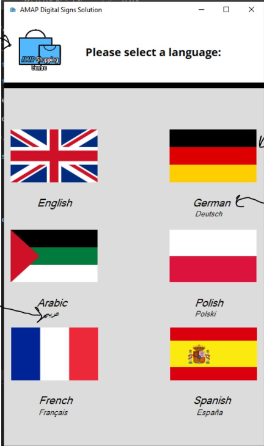
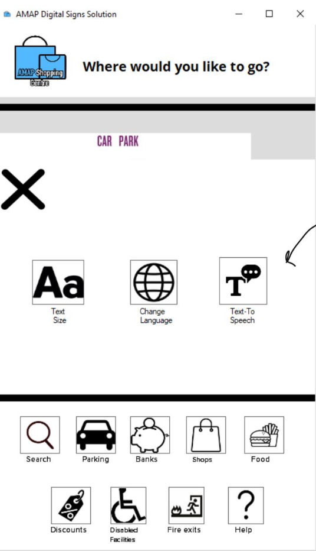
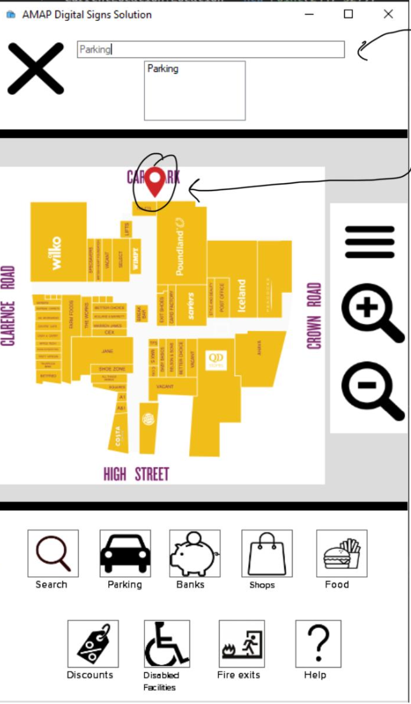

# AMAP Shopping Centre Map

## 📖 About
 This project was an interactive shopping centre map created as part of our HCI unit in college to allow users to find shops and resturants available around the shopping centre. This assignment recieved a Distinction Grade

 ## 🛠️ Technologies used
 - [ ] C# Windows Forms

## 📄 Project Images

## 📚 Assignment Documentation
